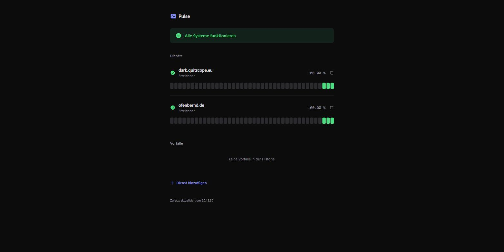
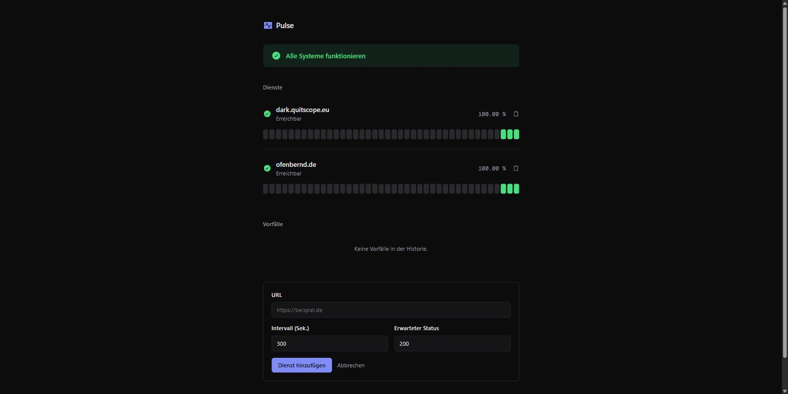

# Pulse

Ja, es ist wieder ein typischer Uptime-Monitor. Registriert URLs, prüft sie in festen Intervallen, merkt sich Ausfälle, zeigt eine Status-Seite. Nichts Neues an der Idee - gebaut hauptsächlich aus Spaß und um mein eigenes Home Network im Blick zu haben (ist mein Pi/NAS/Reverse-Proxy grad down oder bin nur ich offline).

<p align="center">
  
</p>

<p align="center">
  
</p>

## Stack

- **Backend**: Node 22, TypeScript, Fastify, TypeORM + Postgres, BullMQ + Redis, Awilix (DI), Pino
- **Frontend**: Vite, React, Tailwind v4
- **Sonst**: pnpm Workspaces, tap für Tests, Docker Compose für Postgres/Redis

## Architektur

Server und Worker sind getrennte Prozesse. Der Server nimmt HTTP-Requests an und schiebt fällige Checks in eine Redis-Queue (BullMQ). Der Worker zieht die Jobs und führt die eigentlichen HTTP-Checks aus. Heißt: Worker lässt sich beliebig oft parallel starten, ohne dass sich was ins Gehege kommt.

## Laufen lassen

```bash
docker compose up -d          # Postgres + Redis
cp .env.example .env
pnpm install
pnpm migration:run

pnpm dev:all                  # Server + Worker zusammen
```

Frontend separat:

```bash
cd frontend
pnpm dev                      # localhost:5173
```

## Ein Wort zu den Tests

`pnpm test` und `pnpm dev:all` teilen sich aktuell dieselbe Postgres-DB und dieselbe Redis-Queue. Tests räumen die DB per `TRUNCATE` auf - wenn dev:all parallel läuft, sind die eigenen Monitore danach weg. Nicht gleichzeitig laufen lassen, bis das mal eine eigene Test-DB kriegt.
